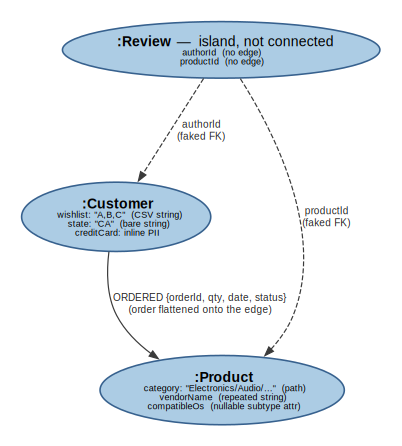
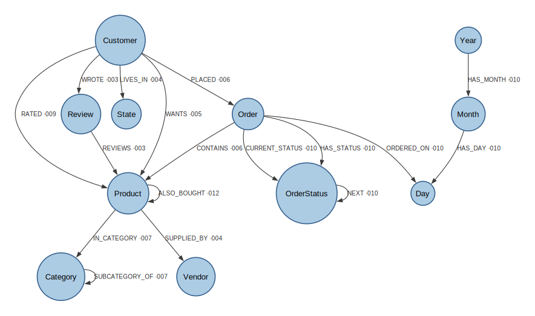

# Graph Database Design Patterns

> A hands-on catalogue of **12 core graph database design patterns**, implemented as a single Neo4j (`OnlineStore`) property graph that **evolves over time** — from a naive, relational-habits-everywhere first draft into a properly connected, indexed, hierarchical, temporal and denormalized production model.

The portfolio is built as a **sequence of 14 Cypher migration scripts** (an initial naive graph, the 12 patterns, and an anti-patterns appendix), each tackling one real modeling decision — _"this id property should be a relationship"_, _"this CSV should be edges"_, _"this product is a supernode, now what?"_ — and each ending with an honest note on the **trade-off** and **when not to use it**.

Every script in this repo has been **run end-to-end against Neo4j 5.26** (the bundled Docker image); the final graph and its example queries are verified, not aspirational.

---

## The graph

`OnlineStore` starts as the naive graph below and, after 12 migrations, becomes the connected model further down.

### Before — the naive starting point

[`src/000_initial_graph.cypher`](src/000_initial_graph.cypher) is deliberately imperfect: it carries relational habits straight into the graph, so the later scripts have something real to fix. Note how `Review` is an **island** — it references its author and product by _id properties_, so there's nothing to traverse yet.

<p align="center">
  
</p>

### After — once all 12 migrations are applied

Real relationships, extracted lookup/reference nodes, a reified `Order`, a native category tree, multi-label subtypes, status history, a time-tree and materialized recommendation edges. The annotations show which pattern introduced each relationship. Constraints/indexes (001/002) and the `:Software`/`:Hardware` subtype labels (008) aren't edges, so they're noted in prose rather than drawn.

<p align="center">
  
</p>

> `:Product` additionally carries a subtype label — `(:Product:Software)` or `(:Product:Hardware)` — from pattern 008, and cached `avgRating` / `numReviews` properties from pattern 012.

<sub>Diagrams generated with [Graphviz](https://graphviz.org) from the sources in [`docs/images/`](docs/images/) — e.g. `dot -Tsvg docs/images/graph-neo4j-after.dot -o docs/images/graph-neo4j-after.svg`.</sub>

---

## The 12 patterns

Row `000` is the initial naive graph and diagnostic tooling; the 12 design patterns are `001`–`012`. Each row links to the **runnable Cypher** and a short **write-up**. The "What it solves" column is a one-line summary of the problem each pattern addresses, with the closest **relational analog** from the sister repo in parentheses.

| #   | Pattern                                              | What it solves (relational analog)                                                                                               | Script                                             | Notes                                                 |
| --- | ---------------------------------------------------- | -------------------------------------------------------------------------------------------------------------------------------- | -------------------------------------------------- | ----------------------------------------------------- |
| 000 | Initial graph & diagnostic tooling                   | The naive starting graph + introspection used throughout (≈ initial schema 000).                                                 | [cypher](src/000_initial_graph.cypher)             | [doc](docs/patterns/000-initial-graph.md)             |
| 001 | Constraints & node keys                              | Node identity and uniqueness (≈ primary keys, 001).                                                                              | [cypher](src/001_constraints_and_keys.cypher)      | [doc](docs/patterns/001-constraints-and-keys.md)      |
| 002 | Indexing traversal entry points                      | Fast anchors so traversals don't start with a label scan (≈ indexing strategy, 002/003).                                         | [cypher](src/002_indexing_entry_points.cypher)     | [doc](docs/patterns/002-indexing-entry-points.md)     |
| 003 | Foreign keys → relationships                         | Turning faked id-property references into first-class relationships (≈ foreign keys, 003).                                       | [cypher](src/003_ids_to_relationships.cypher)      | [doc](docs/patterns/003-ids-to-relationships.md)      |
| 004 | Property → node                                      | Extracting repeated strings into shared, traversable nodes (≈ lookup/reference tables, 007/008).                                 | [cypher](src/004_property_to_node.cypher)          | [doc](docs/patterns/004-property-to-node.md)          |
| 005 | Many-to-many is just a relationship                  | Replacing a CSV column with relationships — no junction entity (≈ associative table, 010).                                       | [cypher](src/005_many_to_many_relationship.cypher) | [doc](docs/patterns/005-many-to-many-relationship.md) |
| 006 | Intermediate (reified) nodes                         | Promoting a relationship that needs identity/attributes to a node (≈ associative + master/detail, 010/011).                      | [cypher](src/006_intermediate_node.cypher)         | [doc](docs/patterns/006-intermediate-node.md)         |
| 007 | Native hierarchies                                   | Modeling a tree as relationships + variable-length traversal (≈ hierarchical data, 016).                                         | [cypher](src/007_native_hierarchy.cypher)          | [doc](docs/patterns/007-native-hierarchy.md)          |
| 008 | Supertype/subtype via multiple labels                | Polymorphism with stacked labels instead of subtype tables (≈ subtype tables, 017/018).                                          | [cypher](src/008_subtypes_via_labels.cypher)       | [doc](docs/patterns/008-subtypes-via-labels.md)       |
| 009 | Relationship granularity & properties on edges       | Choosing property vs type vs node for a connection, and its perf impact (graph-specific).                                        | [cypher](src/009_relationship_granularity.cypher)  | [doc](docs/patterns/009-relationship-granularity.md)  |
| 010 | Temporal modeling                                    | State history as a linked list + a time-tree (≈ history / effective-dating / temporal, 012/013).                                 | [cypher](src/010_temporal_modeling.cypher)         | [doc](docs/patterns/010-temporal-modeling.md)         |
| 011 | Supernode / dense-node mitigation                    | Handling nodes with huge degree — the graph's data-skew problem (≈ partitioning, 014/015).                                       | [cypher](src/011_supernode_mitigation.cypher)      | [doc](docs/patterns/011-supernode-mitigation.md)      |
| 012 | Denormalization: materialized rels & aggregates      | Caching aggregates and materializing traversal shortcuts (≈ JSON denormalization / computed column, 021/022).                    | [cypher](src/012_denormalization_shortcuts.cypher) | [doc](docs/patterns/012-denormalization-shortcuts.md) |
| 013 | Anti-patterns & when _not_ to use a graph (appendix) | Read-only diagnostics for over-graphing, label / relationship-type explosion, supernodes, blob properties, unbounded traversals. | [cypher](src/013_anti_patterns.cypher)             | [doc](docs/patterns/013-anti-patterns.md)             |

---

## Run it yourself

Everything runs on **Neo4j 5.26 Community**, and the bundled Docker setup is self-contained — you don't need Neo4j or `cypher-shell` installed on your machine. The repo is mounted into the container at `/workspace`, and the commands below use the `cypher-shell` that ships inside the image.

> ⚠️ The scripts are **sequential migrations** — each one transforms the graph left by the previous one. Run them in order (`conventions` → `000` → `001` → … → `013`); you can't apply one in isolation (e.g. `012`'s co-purchase edges need the `Order` nodes that `006` introduces). The `013` appendix is read-only diagnostics — safe to run last, or against any graph.

### 1. Start Neo4j

```bash
docker compose up -d
```

This launches `neo4j:5.26` on `localhost:7474` (Browser) and `localhost:7687` (Bolt), user `neo4j`, password in [`docker-compose.yml`](docker-compose.yml), with the APOC core plugin auto-installed and the repo mounted at `/workspace`.

> **Ports already in use?** If you already run another Neo4j on `7474`/`7687`, create a `.env` file next to `docker-compose.yml` with `NEO4J_HTTP_PORT=7475` and `NEO4J_BOLT_PORT=7688` (any free ports) — Compose picks it up automatically and the two instances run side by side. The `docker exec … cypher-shell` commands below are unaffected, since they run _inside_ the container.

### 2. Apply every script, in order

Wait for the server to accept connections, then run the whole sequence:

```bash
# wait until Neo4j is ready
until docker exec onlinestore-neo4j \
  cypher-shell -u neo4j -p Your_password123 "RETURN 1" >/dev/null 2>&1; do
  echo 'waiting for Neo4j...'; sleep 3
done

# conventions -> 000 (naive graph + seed) -> 001..013, in order, stopping on first error
docker exec onlinestore-neo4j bash -c '
  CS="cypher-shell -u neo4j -p Your_password123"
  $CS -f /workspace/helpers/conventions.cypher
  for f in /workspace/src/0*.cypher; do
    echo ">>> applying $f"
    $CS -f "$f" || { echo "FAILED at $f"; exit 1; }
  done'
```

Each script records itself as a `(:_Migration)` node on completion, so you can always see how far the graph has evolved:

```bash
docker exec onlinestore-neo4j \
  cypher-shell -u neo4j -p Your_password123 \
  "MATCH (m:_Migration) RETURN m.id, m.description ORDER BY m.id;"
```

For interactive exploration, open **Neo4j Browser** at <http://localhost:7474> (connect to `bolt://localhost:7687`, user `neo4j`, password `Your_password123`) and paste queries from [`src/`](src/). `:play` the diagnostic queries at the bottom of `000` to see the schema and counts.

### Reset to a clean slate

```bash
docker exec onlinestore-neo4j \
  cypher-shell -u neo4j -p Your_password123 -f /workspace/helpers/reset.cypher
```

Then re-run the sequence above to rebuild from `000`. (To wipe everything including the data volume instead, use `docker compose down -v`.)

---

## Repository layout

```
.
├── src/                 # The 14 Cypher migration scripts (000 → 013), run in order
├── helpers/
│   ├── conventions.cypher  # Naming conventions + the _Migration constraint (see below)
│   └── reset.cypher        # Tear the graph back down to empty
├── docs/
│   ├── patterns/        # One short write-up per pattern (problem / solution / trade-off)
│   └── images/          # Graphviz sources (*.dot) + rendered SVG diagrams (before / after)
├── docker-compose.yml   # One-command Neo4j 5.26 + APOC
└── README.md
```

## Naming conventions

A property graph distinguishes its three building blocks by casing, and this repo follows the Neo4j / openCypher community idiom consistently — documented in [`helpers/conventions.cypher`](helpers/conventions.cypher):

- **Node labels** — `PascalCase`, singular: `(:Customer)`, `(:Order)`
- **Relationship types** — `UPPER_SNAKE_CASE` verb phrases: `[:PLACED]`, `[:SUBCATEGORY_OF]`
- **Property keys** — `camelCase`: `customerId`, `listPrice`, `orderDate`

(The sister relational repo uses `snake_case` for everything; Cypher deliberately uses casing to tell labels, types and properties apart — itself the small design lesson behind pattern [003](docs/patterns/003-ids-to-relationships.md).)

---

## License

Code and documentation © Michał Panasiuk, released under the [MIT License](LICENSE).
